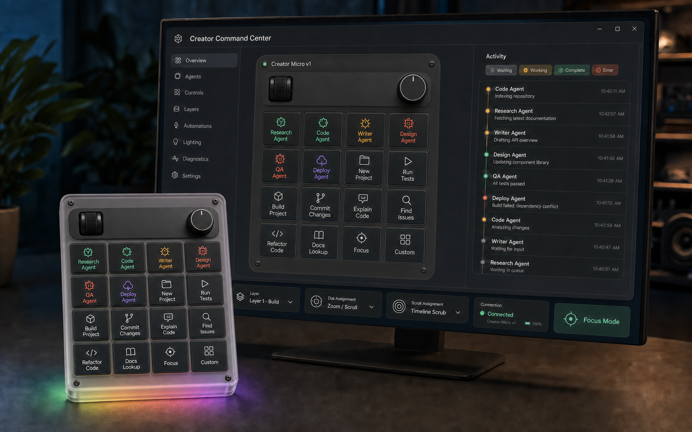

# Creator Command Center

## Product direction

Creator Command Center turns the original Creator Micro into a general-purpose control surface for
local AI agents and high-frequency creator workflows. It borrows the useful product principles of
the Codex Micro—glanceable state, tactile commands, and contextual layers—without copying its
branding, icon set, key arrangement, or application interface.

The Windows application must represent the attached Creator Micro accurately:

- one separate top control rail with a scroll wheel and rotary dial;
- a four-column by four-row matrix of exactly sixteen keys;
- six agent-status positions and ten action positions by default;
- shared RGB/underglow behavior that reflects the Creator Micro v1 VIA limitations;
- explicit connection, protocol, layer, and write-safety status.

## Default Build layer

| Position | Assignment | Type |
|---|---|---|
| 1 | Research Agent | Agent status |
| 2 | Code Agent | Agent status |
| 3 | Writer Agent | Agent status |
| 4 | Design Agent | Agent status |
| 5 | QA Agent | Agent status |
| 6 | Deploy Agent | Agent status |
| 7 | New Project | Action |
| 8 | Run Tests | Action |
| 9 | Build Project | Action |
| 10 | Commit Changes | Action |
| 11 | Explain Code | Action |
| 12 | Find Issues | Action |
| 13 | Refactor Code | Action |
| 14 | Docs Lookup | Action |
| 15 | Focus | Mode/action |
| 16 | Custom | User-defined action |

The dial defaults to zoom or scroll. The scroll wheel defaults to activity-timeline scrubbing.
Every assignment is layer-specific and editable.

## Information architecture

The first implementation should use eight destinations only:

1. Overview
2. Agents
3. Controls
4. Layers
5. Automations
6. Lighting
7. Diagnostics
8. Settings

Overview owns the three most important questions:

- Is the correct device connected and safe to use?
- Which agents or workflows need attention now?
- What will each physical control do on the active layer?

## Visual system

- Graphite shell: `#11151C`
- Raised panel: `#191F28`
- Primary text: `#F2F4F7`
- Secondary text: `#9BA6B5`
- Connected/complete: `#63E6A8`
- Working: `#F2BA4B`
- Waiting: `#A98BFF`
- Error: `#FF725E`

Status color must never be the only signal. Each state also receives an icon and plain-language
label. The layout targets WCAG AA contrast for normal text and preserves Windows keyboard focus
rings and high-contrast mode.

## Interaction rules

- Hardware reads may run automatically; any write path must be clearly labeled and user-invoked.
- Firmware flashing is outside this application.
- Opening the HID interface must remain shared, never exclusive.
- Focus Mode reduces the dashboard to the device twin, active agents, and urgent activity.
- Agent keys show the assigned agent name plus current state; action keys show the action name.
- Offline mode keeps assignments editable while disabling hardware-only actions.
- The activity timeline defaults to actionable state changes rather than raw diagnostic logs.

## Implementation slices

1. Replace the current diagnostic-only WPF window with the Overview shell and accurate 4x4 twin.
2. Add responsive agent/activity cards using the existing loopback session store.
3. Persist layers and control assignments in a versioned local JSON configuration.
4. Add accessible focus, hover, and state treatments.
5. Connect the dial/scroll and RGB paths only after protocol qualification and explicit write gates.

## Concept-generation prompt

The concept was produced with the built-in image-generation workflow. The final correction required
an explicit four-row map so both the physical device and digital twin contain exactly sixteen keys,
with the two rotary controls in a separate rail above the matrix.
